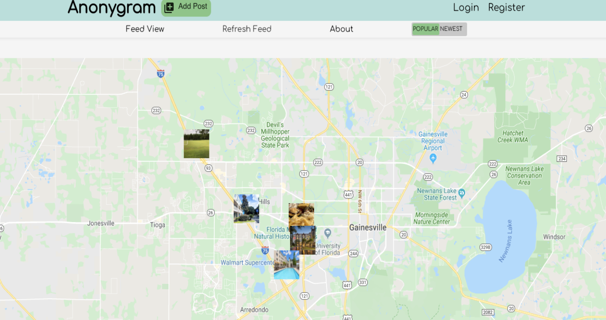
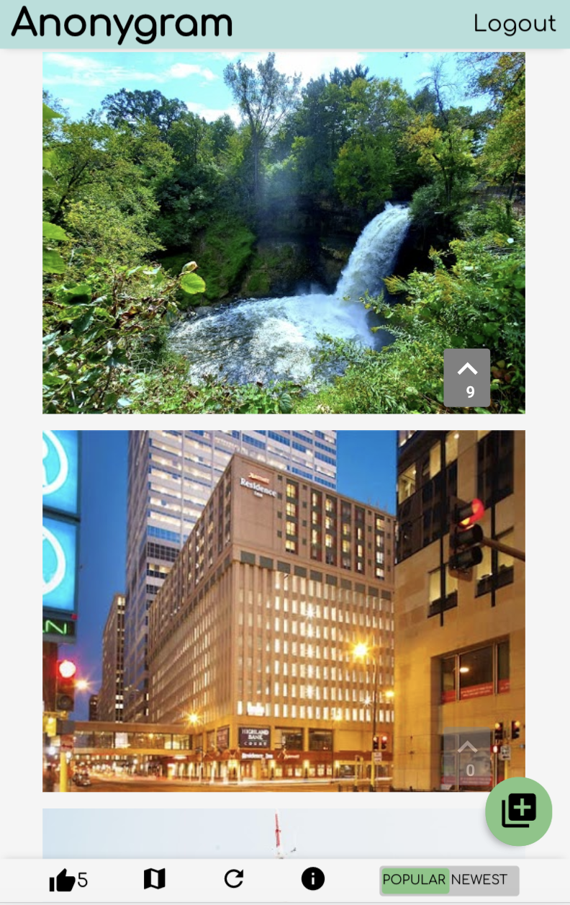

# Anonygram

## Authors 
- James Jenkins
- Kevin Wei
- Phoebe Law
- Scott Schroeder
- Smiti Shakya

## Links

- Link to live app: [Live Version](https://anonygram.now.sh/) 
- Link to client repo: [Client Repo](https://github.com/thinkful-ei-gecko/anonygram-client)
- Link to API repo: [Server Repo](https://github.com/thinkful-ei-gecko/anonygram-server)

## Demo account
      
       username: admin
       password: Password1!

## Screeenshots 

### Desktop View 

### Mobile View

## Summary 

Anonygram is a new form of social media that was created to have a care-free user experience. With this application,
users can anonymously explore, share and engage photogenic happenings to their current metros or while exploring new places.

## Technologies
- React
- HTML5
- CSS3
- Jest/Enzyme
